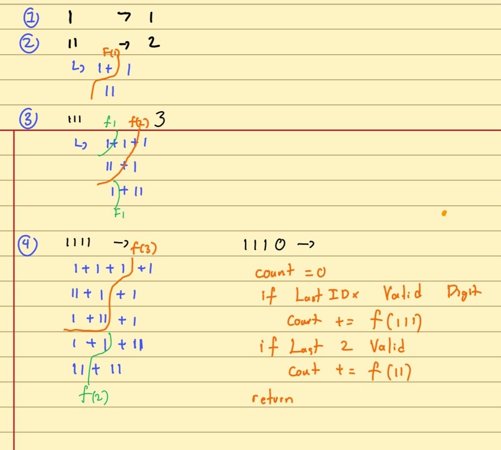

# Flow of Thinking
URL: https://leetcode.com/problems/decode-ways

----

Fist trying to simplify and simulate the example by using repeating value of 1, 11, 111, and 1111.
```
1
- 1

11 
- 1 + 1
- 11

111
- 1 + 1 + 1
- 11 + 1
- 1 + 11

1111
1 | 1 + 1 + 1 + 1 
2 | 11 + 1 + 1
3 | 1 + 11 + 1
4 | 1 + 1 + 11
5 | 11 + 11

11111
1 | 1 + 1 + 1 + 1 + 1
2 | 11 + 1 + 1 + 1
3 | 1 + 11 + 1 + 1
4 | 1 + 1 + 11 + 1
5 | 1 + 1 + 1 + 11
6 | 11 + 11 + 1
7 | 1 + 11 + 11
8 | 11 + 1 + 11
```
This simulation got me to realize that this is a Fibonacci sequence, so something related to `f(n) = f(n-1) + f(n-2)`

This is also confirmed by the fact that we can break down the problem to only check the last (n-1) and the two last digits (n-2).


Try simulating it on paper make it more obvious as how it can be sovled using a recursion Recursion (and optimized with Dynamic Programming)


The last part of the paper shows the whole algorithm. The realization is that the functions should take the substring of the input (rather than the index) to allow for length checks and cut the last digit or the last two digits of the string to its lower recursion.
```
11110
1 | 1 + 1 + 1 + 1 + 0 -- Invalid
2 | 11 + 1 + 1 + 0 -- Invalid
3 | 1 + 11 + 1 + 0 -- Invalid
4 | 1 + 1 + 11 + 0 -- Invalid
5 | 11 + 11 + 0- -- Invalid
6 | 1 + 1 + 1 + 10
7 | 1 + 11 + 10
8 | 11 + 1 + 10
```


